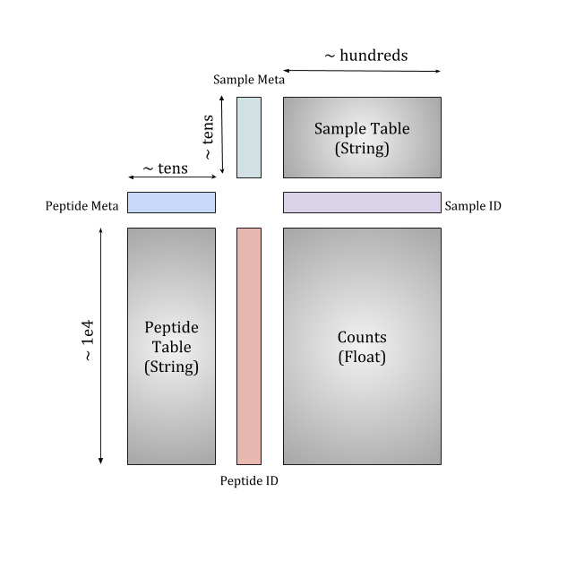

# Spike Phage DMS Repo

This repository contains all necessary code for analysis described in "High resolution profiling of pathways of escape for SARS-CoV-2 spike-binding antibodies by Garrett et al"

The repository contains the code for generating the sequences used to make the Spike Phage-DMS library, a [Nextflow](https://www.nextflow.io/docs/latest/getstarted.html) pipeline,
dubbed [phip-flow](https://github.com/matsengrp/phip-flow) to align illumina sequencing reads, along with all analysis and plotting code.

### Abstract

Defining long-term protective immunity to SARS-CoV-2 is one of the most pressing questions of our time and will require a detailed understanding of potential ways this virus can evolve to escape immune protection. Immune protection will most likely be mediated by antibodies that bind to the viral entry protein, Spike (S). Here we used Phage-DMS, an approach that comprehensively interrogates the effect of all possible mutations on binding to a protein of interest, to define the profile of antibody escape to the SARS-CoV-2 S protein using COVID-19 convalescent plasma. Antibody binding was common in two regions: the fusion peptide and linker region upstream of the heptad repeat region 2. However, escape mutations were variable within these immunodominant regions. There was also individual variation in less commonly targeted epitopes. This study provides a granular view of potential antibody escape pathways and suggests there will be individual variation in antibody-mediated virus evolution. 

### Spike Phage-DMS library design

All code used to optimize sequences and generate oligonucleotides to create the Spike Phage-DMS library can be found within the `library-design` directory. See README file within that directory for a description of the files needed and scripts run.

### Alignment of sequence reads

**phip-flow analysis environment**

The library design script and analysis notebooks contain all code needed to run analysis 
for the manuscript using custom code from 
[phippery](https://github.com/matsengrp/phippery) along with a few other popular python packages.

We suggest using [conda](https://www.anaconda.com/) to create the environment like so:
```
conda env create -f environment.yml && conda activate Spike-Phage-DMS
mkdir -p _ignore && cd _ignore
git clone git@github.com:matsengrp/phippery.git
cd phippery && python setup.py install --user && cd ../../
```

### Running the alignment pipeline

All raw fastq files for the samples can be obtained upon request and will be provided in a tarball, `NGS.tar`.
Place this file in the `alignment-pipeline/` directory and run `tar -xvf NGS.tar` to produce the `NGS` Directory.

The pipeline can be run anywhere with `Nextflow` and `Docker` (or `Singularity`) installed. 
The scripts inside the directory provide an example of how to run the pipeline on our local Fred Hutch cluster, gizmo.
To run on you're own compute system: 
(1) Create a config file similar to `nextflow.gizmo.config` that describes the job submission parameters and partitions you would like to use.
(2) Create a run script using `run_gizmo_meg.sh` as a template with your own paths for temporary directories and modules you might need to load.
More instruction on creating config files can be found [here](https://www.nextflow.io/docs/latest/config.html#configuration-file)

After the pipeline finishes merging all counts from the alignments,
the output of the pipeline is a file, `phip_data/phage-dms-spike`
containing sample and peptide metadata tied to the raw counts matrix like so:

<p align="center">
  
</p>

With the colored columns representing coordinate dimensions and the grey squares representing data arrays
organized by respective shared dimensions.

### Final analysis and plotting of data

All code used to wrangle and plot data to generate figures for publication can be found within the `analysis-and-plotting` directory, and requires the `Curated_Samples_Phage_DMS_Analysis.csv` output file generated by the phip-flow pipeline.
